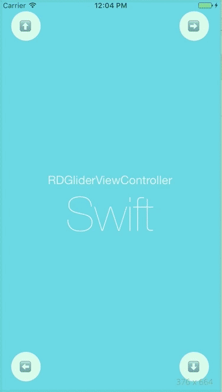
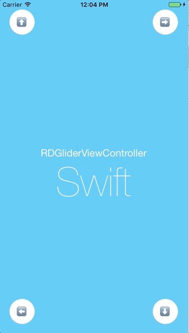
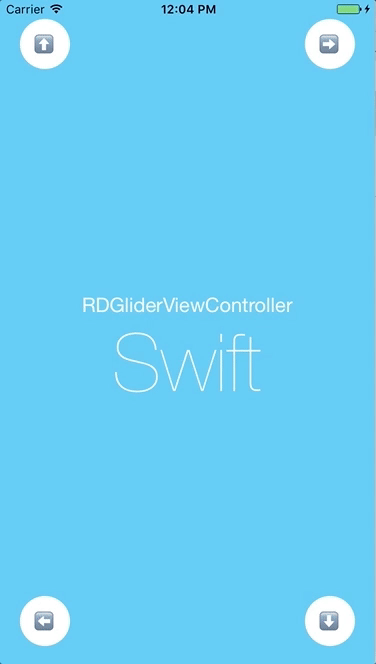
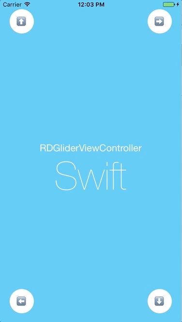

# 🛫 RDGliderViewController 🛬

[](https://travis-ci.org/gelemias/RDGliderViewController-Swift) [](https://coveralls.io/github/gelemias/RDGliderViewController?branch=develop) [](https://opensource.org/licenses/MIT) [](https://github.com/Carthage/Carthage)


Control in *Swift* for a draggable ViewController gliding over another ViewController, if you are looking for the equivalent in *Objective-C* go [here](https://github.com/gelemias/RDGliderViewController/).

RDGliderViewController is a view controller that manages a scrollable view using one side as a sliding point, choosing between Left-to-Right, Top-to-Bottom, Right-to-Left and Bottom-to-Top, and setting an array of offsets as percent values to determine the gliding view steps, as described bellow.

   

## Example

A good way to learn how to use RDGliderViewController is to go through the example app. Take a look at the tests as well for a more thorough usage.

To run the example project, clone the repo, and open `./Example/GliderSample.xcodeproj`

## Installation

### Using CocoaPods
RDGliderViewController is available through [CocoaPods](http://cocoapods.org), a dependency manager for Swift and Objective-C Cocoa projects. To install
it, simply add the following line to your [Podfile](https://guides.cocoapods.org/using/getting-started.html):

```ruby
pod 'RDGliderViewController'
```

### Using Carthage

[Carthage](https://github.com/Carthage/Carthage) is a decentralized dependency manager that builds your dependencies and provides you with binary frameworks.

You can install Carthage with [Homebrew](http://brew.sh/) and then integrate **RDGliderViewController** into your Xcode project by adding the following line to your [Cartfile](https://github.com/Carthage/Carthage/blob/master/Documentation/Artifacts.md#cartfile):

```ruby
github "gelemias/RDGliderViewController"
```

### Manual Installation

For an old fashion installation you can directly add the **header** and **implementation** files for `RDGliderViewController` and `RDScrollView` to your project.

- Download the latest code version or add the repository as a git submodule to your git-tracked project.

- Drag and drop the folder `RDGliderViewController/` onto your project and make sure to select **Copy items if needed**.

- Add `#import "RDGliderViewController.h"` at the beginning of your class.

## Usage

RDGliderViewController is a very simple to use controller that mainly depends on three values to work on, *Orientation type* which is determines the scrolling side, the *List of Offsets* which represent the steps of expansion and contraction and the content itself with is a view controller completely independent.

### Creation

Use a the following custom init to instantiate RDGliderViewController:

`- (instancetype)initOn:(nonnull UIViewController *)parent WithContent:(nonnull RDGliderContentViewController *)content type:(RDScrollViewOrientationType)type AndOffsets:(nonnull NSArray<NSNumber *> *)offsets {
`

e.g.
```Objective-C
RDGliderViewController *gliderVC = [[RDGliderViewController alloc] initOn:self
                                                              WithContent:[UIViewController new]
                                                                     type:RDScrollViewOrientationRightToLeft
                                                               AndOffsets:@[@0.2, @0.5, @1]];
```

And that's all you need to do, if you run your app, an instance of UIViewController should be scrollable from Right to Left on top of `self` view controller.

### Content and Container

The content view controller should inherit from RDGliderContentViewController to inherit the properly resize when rotating, is treated as a child view controller of this one.

```Objective-C
#import "RDGliderContentViewController.h"

@interface ContentViewController : RDGliderContentViewController

// Your content class Here

@end

```

Mentioned that not much more is required, only keep in mind that if you do not define a size for the view, RDGliderViewController will it resize it to match container's.

Content view controller can be afterwards as well but always along offsets and orientation since these three properties are dependent of each other:

`- (void)setContentViewController:(nonnull RDGliderContentViewController *)contentViewController
                            type:(RDScrollViewOrientationType)type
                         offsets:(nonnull NSArray<NSNumber *> *)offsets;
`

### Orientation types

`RDScrollViewOrientationType` represent the four sides of the display plus the sliding direction.

```Objective-C
typedef NS_ENUM(unsigned int, RDScrollViewOrientationType) {
    RDScrollViewOrientationUnknown = 0,

    RDScrollViewOrientationLeftToRight,
    RDScrollViewOrientationBottomToTop,
    RDScrollViewOrientationRightToLeft,
    RDScrollViewOrientationTopToBottom

};
```

if content view controller defines a fixed size, this size will be respected during rotation, for horizontal scrolls (Left-to-Right and Right-to-Left) will resize *Width* and for Vertical (Bottom-to-Top and Top-to-Bottom) will reize *Height*


### Offsets and OffsetIndex

this `NSArray<NSNumber *> *offsets` property is a list of steps used when either expanding / collapsing or dragging the list is represented in percent % related with the length of the content view controller, e.g. given the list [0, 0.5, 1] for a lenght *400px* would be this offset steps of [0px, 200px, 400px]

`offsets[OffsetIndex].floatValue * contentViewController.lenght`

For inverted OrientationTypes (RDScrollViewOrientationLeftToRight and RDScrollViewOrientationTopToBottom), the offset list are also inverted so for example for a list [0.2, 0.4, 0.6, 1] will be returned [0.8, 0.6, 0.4, 0]

### Expand, Collapse and Close

By default RDGliderViewController is draggable but when setting an offset of `0.0f%` it will be outside of the screen on starting point, to Increase the position of the view by one in the list of offsets use:

`- (void)expand;`

to Decrease the position of RDGliderViewController by one in the list of offsets:

`- (void)collapse;`

and *close* which moves the View directly to the first offset which is the default position:

`- (void)close;`

All of these methods simple change the offsetIndex when calling this method.

`- (void)changeOffsetTo:(NSUInteger)offsetIndex animated:(BOOL)animated;`

## License

RDGliderViewController is released under the MIT license. See [LICENSE](https://github.com/gelemias/RDGliderViewController/blob/develop/LICENSE) for details.


## Change log

See [CHANGELOG](https://github.com/gelemias/RDGliderViewController/blob/develop/CHANGELOG.md) for details.
